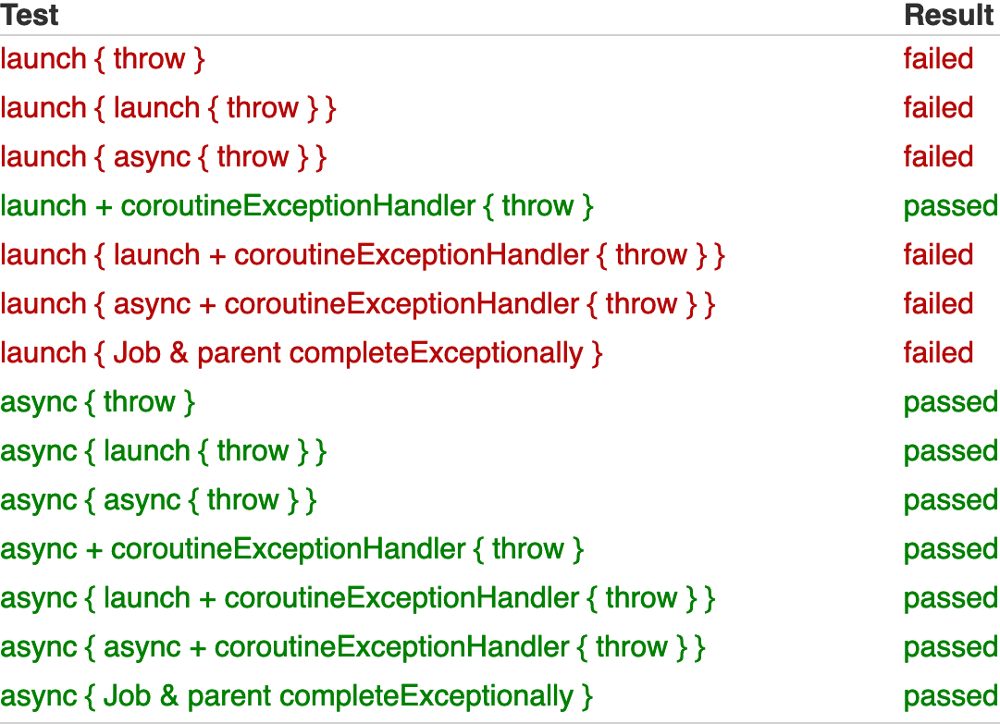
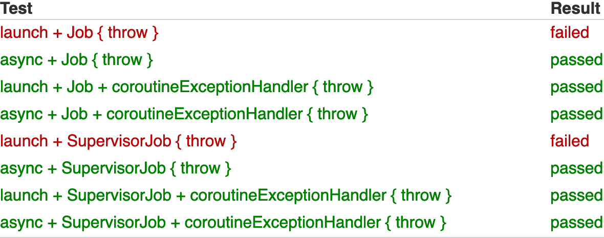
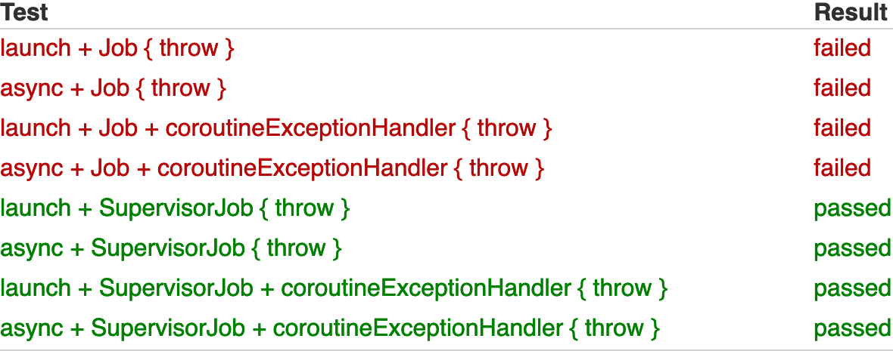
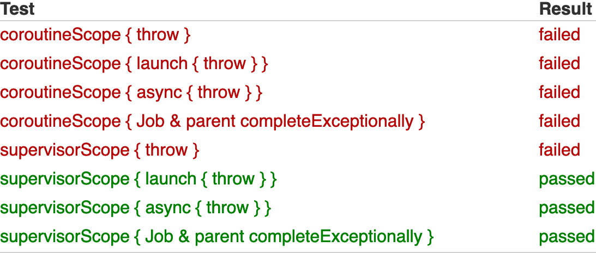
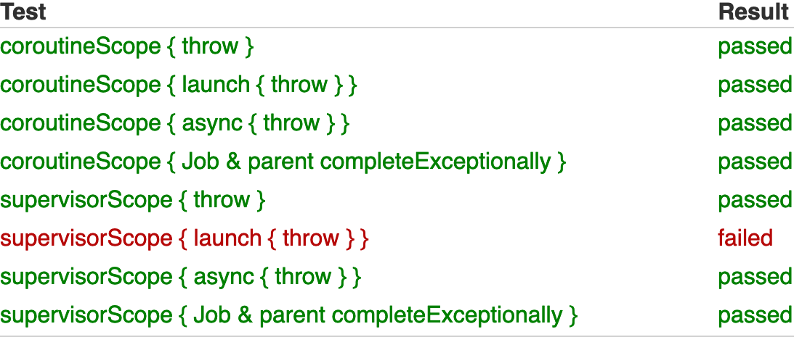

# Coroutines-Completion-Demo

Demo of the behavior of Kotlin coroutines with regards to completion.

## Coroutine Builder Failure

Failure indicates that the default uncaught exception handler was
invoked.

[BuilderFailureUncaughtExceptionHandlerTest.kt](src/test/kotlin/com/mdevillers/coroutines/completion/demo/BuilderFailureUncaughtExceptionHandlerTest.kt)

## Factory Job Child Failure

1. Failure indicates that the default uncaught exception handler was
   invoked.

[JobFailureUncaughtExceptionHandlerTest.kt](src/test/kotlin/com/mdevillers/coroutines/completion/demo/JobFailureUncaughtExceptionHandlerTest.kt)

2. Failure indicates that the job failed.

[JobFailureCancellationTest.kt](src/test/kotlin/com/mdevillers/coroutines/completion/demo/JobFailureCancellationTest.kt)

## Scope Builder Failure

1. Failure indicates that the scope builder function threw an exception.

[ScopeFailureExceptionTest.kt](src/test/kotlin/com/mdevillers/coroutines/completion/demo/ScopeFailureExceptionTest.kt)

2. Failure indicates that the default uncaught exception handler was
   invoked.

[ScopeFailureUncaughtExceptionHandlerTest.kt](src/test/kotlin/com/mdevillers/coroutines/completion/demo/ScopeFailureUncaughtExceptionHandlerTest.kt)
